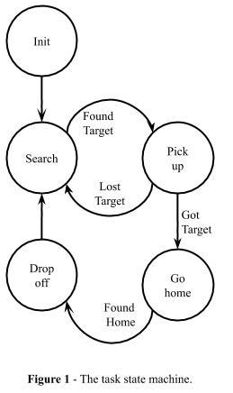
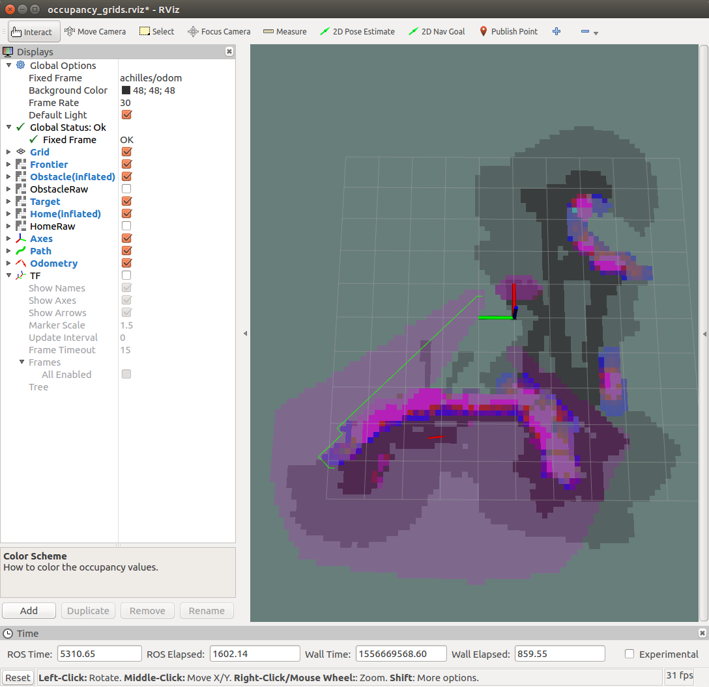
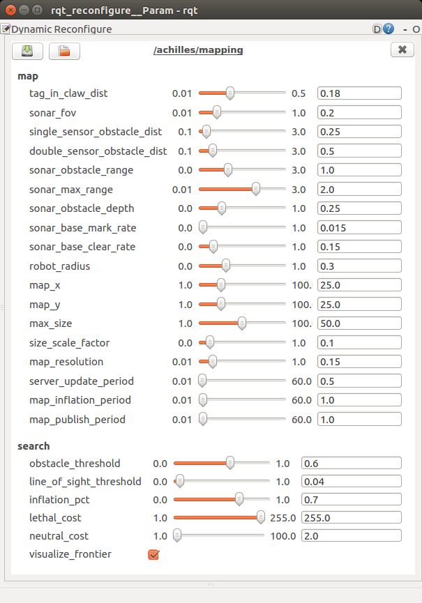

# Swarmathon-Cabrillo

This repository contains Cabrillo College's 2018 & 2019 submissions to the [NASA Swarmathon](http://www.nasaswarmathon.com), a national swarm robotics competition.

The base code provided to participating schools can be found here [SwarmBaseCode-ROS](https://github.com/BCLab-UNM/SwarmBaseCode-ROS).

This repository contains:

1. Source code for ROS packages that control different aspects of the Swarmie robot, including robot behaviours such as search strategies and obstacle avoidance, diagnostics, and user interface elements. 
2. 3D .STL models for the physical Swarmie build 
3. Bash shell scripts and launch files for initializing simulated Swarmies in the Gazebo simulator, as well as physical Swarmies

Be sure you are using the latest drivers for your video card using the "additional drivers tool" in Ubuntu. Gazebo client often does not do well with the open source drivers.


## Quick Start Installation Guide

SwarmBaseCode-ROS is designed and tested exclusively on the 64 bit version of Ubuntu 16.04 LTS (Xenial Xerus) and ROS Kinetic Kame. Other systems are untested and are therefore not supported at this time.

### Summary:
1. Install ROS Kinetic. Instructions below in the detailed guide.
2. Install dependencies, clone and build.
    ```bash
    sudo apt install python-rosinstall python-catkin-tools ros-kinetic-robot-localization ros-kinetic-hector-gazebo-plugins ros-kinetic-joystick-drivers ros-kinetic-grid-map ros-kinetic-rosserial-python ros-kinetic-rosserial-arduino ros-kinetic-usb-cam ros-kinetic-multimaster-fkie libusb-dev ipython
    git clone --recursive git@github.com:BCLab-UNM/Swarmathon-Cabrillo.git
    cd Swarmathon-Cabrillo
    catkin build
    source ./devel/setup.bash
    ```

### Detail
#### 1. Install ROS Kinetic Kame

Detailed instructions for installing ROS Kinetic Kame under Ubuntu 16.04 [here](http://wiki.ros.org/kinetic/Installation/Ubuntu) or follow the summarized instructions below:

```
sudo sh -c 'echo "deb http://packages.ros.org/ros/ubuntu $(lsb_release -sc) main" > /etc/apt/sources.list.d/ros-latest.list'

sudo apt-key adv --keyserver hkp://ha.pool.sks-keyservers.net:80 --recv-key 421C365BD9FF1F717815A3895523BAEEB01FA116

sudo apt update
sudo apt install ros-kinetic-desktop-full
sudo rosdep init
rosdep update      # Note this is not run with sudo
```

Note: if you accidentally ran ```sudo rosdep update``` you can repair the permissions ```sudo rosdep fix-permissions```.


##### Environment Setup
From ROS Wiki: It's convenient if the ROS environment variables are automatically added to your bash session every time a new shell is launched:
```
echo "source /opt/ros/kinetic/setup.bash" >> ~/.bashrc
source ~/.bashrc
```

#### 2. Install additional packages

We use [catkin_tools](https://catkin-tools.readthedocs.io/) to build:

```
sudo apt install python-rosinstall python-catkin-tools
```

Most systems will already have usb development support installed, but just in case:

```
 sudo apt install libusb-dev
```

We use [robot_localization](http://wiki.ros.org/robot_localization) for state estimation and sensor fusion:

```
sudo apt install ros-kinetic-robot-localization
```

In simulation, we use [hector_gazebo_plugins](http://wiki.ros.org/hector_gazebo_plugins) to provide sonar and IMU sensors:

```
sudo apt install ros-kinetic-hector-gazebo-plugins
```

The Swarmies can receive commands from the thumb sticks on a Microsoft Xbox 360 controller. The ROS [joystick_drivers](http://wiki.ros.org/joystick_drivers) package, which contains a generic Linux joystick driver compatible with this controller:

```
 sudo apt install ros-kinetic-joystick-drivers
```

Joystick commands can also be simulated using the direction keys (Up=I, Down=K, Left=J, Right=L) on the keyboard. The Rover GUI window must have focus for keyboard control to work.

Install the usb camera driver, which runs on the physical rover:
```
sudo apt install ros-kinetic-usb-cam
```

Install ROS Serial, which is used to run the IMU calibration code:
```
sudo apt install ros-kinetic-rosserial-python ros-kinetic-rosserial-arduino
```

Install ROS Multimaster, which is used to sync the ROS graphs of each physical rover:
```
sudo apt install ros-kinetic-multimaster-fkie
```

Install ROS Grid Map, which is used to build maps containing sonar-marked obstacles and locations of AprilTag detections:
```
sudo apt install ros-kinetic-grid-map 
```

Install IPython, which we use to help develop robot behavior code.
```
sudo apt install ipython
```

#### 3. Clone the repository and build:

1. Install git, if necessary.
    ```
    sudo apt install git
    ```

2. Clone the repository, initialize submodules, and build:
    ```
    git clone --recursive git@github.com:BCLab-UNM/Swarmathon-Cabrillo.git
    cd Swarmathon-Cabrillo
    catkin build
    ```
    
#### 4. Run the simulation:

1. Start the GUI
  ```
  ./run.sh
  ```

The GUI will now launch.

This is the first screen of the GUI:


Click the "Simulation Control" tab:


There are several settings you can change:

- Target Distribution: Choose between randomly generating a uniform, clustered, or power law distribution. You can also select a custom Gazebo world file; there are several pre-made world files included in the base code!

- Number of Cubes: When you select a uniform or clustered target distribution, you can select the total number of apriltag cubes placed. This is not available for the power law distribution or custom world files at this time. The point of this option is to speed up the process of placing cubes in the simulation using these distribution types.

- Ground Texture: Choose the kind of ground texture that will appear in the Gazebo simulation.

- Round Type: Preliminary round creates a 15 meter square arena and generates a default of three rovers. Final round creates a 23.1 meter square arena and generates a default of six rovers. Unbounded round does not place any barriers around the edge of the arena, it generates a default of three rovers, and you can set the size of the arena in the dropbox below the unbounded radio button. Cubes placed using the uniform, clustered, or powerlaw target distributions will use this arena size to determine random placements.

- Set Number of Rovers: Optional. If you select this checkbox, you can customize the exact number of rovers that will be created regardless of the round type. You can create from 0 to 8 rovers.

- Simulation Length: Optional. By default there is no timer set. If you select a timer from the drop down list, when you click the "All Autonomous" button the Gazebo simulation will run for the specified time before stopping all of the rovers (the equivalent of pressing the "Stop All Rovers" button). Please note that a twenty minute timer will run for twenty minutes of simulated time. That is, the amount of time that the simulation needs to simulate twenty real world minutes of time. You can look at the real time factor in Gazebo to get a feel for this, but it is generally slower than real time.

    tldr: A simulation timer for twenty minutes *might* take anywhere from thirty minutes to sixty minutes to actually complete.

- Create Savable Gazebo World: Selecting this option will create a Gazebo simulation that does not include rovers, a collection zone, or wall barriers. The point of this is to create a uniform, clustered, or power law distribution (which takes a long time to do) and then save that Gazebo world so that you can load it MUCH more quickly for testing your simulated rovers later on.

Click the "Build Simulation" button when ready.

The Gazebo physics simulator will open.


Click back to the Swarmathon GUI and select the "Sensor Display" tab.


Any active rovers, simulated and/or real, will be displayed in the rover list on the left side. To the right of the rover list is their corresponding connection status. Please note that the number here reflects different things for simulated vs. physical rovers:
- physical rovers: This number represents the wireless link quality and the bitrate of their connection.
- simulated rovers: This number represents their simulation rate as a percentage of real time. For example, 1.0 = moving at 100% real time factor, 0.5 = moving at 50% real time factor, etc.
- all rovers: Green = good connection. Yellow = meh connection. Red = bad connection and/or disconnected.

To the right of the connection status is a checkbox for the map frame. If you select a checkbox for a given rover, it's map information will appear in the map to the right. You can arbitrarily select any number of rovers to be displayed in the map frame.


Select a rover to view its sensor outputs. 


There are four sensor display frames and one settings frame:

The camera output. This is a rover eye's view of the world.

The ultrasound output is shown as three white rays, one for each ultrasound. The length of the rays indicates the distance to any objects in front of the ultrasound. The distance in meters is displayed in text below these rays. The maximum distance reported by the ultrasounds is 3 meters.  

The IMU sensor display consists of a cube where the red face is the bottom of the rover, the blue face is the top of the rover, and the red and blue bars are the front and back of the rover. The cube is viewed from the top down. The cube is positioned according to the IMU orientation data. For example, if the rover flips over, the red side will be closest to the observer. Accelerometer data is shown as a 3D vector projected into 2D space pointing towards the sum of the accelerations in 3D space.
 
The map view shows the path taken by the currently selected rover. Green is the encoder position data. In simulation, the encoder position data comes from the odometry topic being published by Gazebo's skid steer controller plugin. In the real robots, it is the encoder output. GPS points are shown as red dots. The EKF is the output of an extended Kalman filter which fuses data from the IMU, GPS, and encoder sensors.

The map settings frame contains several settings that affect the map view:
- Frame Views: You can check whether the map displays data from EKF (MAP), odometry (ODOM), and/or GPS (NAVSAT).
    Additionally, the Global Frame checkbox moves rovers from all starting at (0,0) to their actual start points (this is for simulated rovers only at this time).
- Panning: You can select whether the map automatically pans to fit all of the map data into the map frame or you can choose to manually pan the map yourself using the mouse to click-and-drag and also zooming with the scroll wheel.
- Unique Rover Colors: Select this option to change the colors in the map frame to display unique rover colors. This will help people to tell the rover paths apart in the map frame after long simulation runs.
- Popout: Click on this box to generate a popout map window that you can maximize or resize however you want. The popout map retains all of the settings you had selected in the original map frame. Changing settings in the RQT GUI will also change things in your popout map.

Look on the left hand side of the RQT Rover GUI.


This section displays important status information:

1. (all rovers) The currently selected rover in the RQT GUI.
2. (physical rovers) The number of GPS satellites detected.
3. (all rovers) The number of obstacle avoidance calls.
4. (simulated rovers) The number of targets collected.
5. (simulated rovers) The current status of the simulation timer after selecting a timer length and clicking the "All Autonomous" button.

To close the simulation and the GUI, click the red exit button in the top left-hand corner.

## Software Documentation

Source code can be found in the repository /src directory. This directory contains several subdirectories, each of which contain a single ROS package. Here we present a high-level description of each package.

- `abridge`: A serial interface between SwarmBaseCode-ROS and the A-Star 32U4 microcontroller onboard the physical robot. In the simulation, `abridge` functionality is supplanted by `sbridge`, which interfaces with [gazebo_ros_skid_steer_drive](http://docs.ros.org/kinetic/api/gazebo_plugins/html/classgazebo_1_1GazeboRosSkidSteerDrive.html) (motor and encoders) and [hector_gazebo_plugins](http://wiki.ros.org/hector_gazebo_plugins) (sonar and IMU; see [step 3](https://github.com/BCLab-UNM/SwarmBaseCode-ROS/blob/master/README.md#3-install-additional-gazebo-plugins) of the Quick Start guide).
- `rqt_rover_gui`: A Qt-based graphical interface for the physical and simulated robots. See [How to use Qt Creator](https://github.com/BCLab-UNM/SwarmBaseCode-ROS/blob/master/README.md#how-to-use-qt-creator-to-edit-the-simulation-gui) for details on this package.
- `mobility`: The Swarmie control API, behaviors, helper functions, debug terminal, teleop and various other nodes.
- `mapping`: The mapping node uses the [Grid Map](https://github.com/anybotics/grid_map) library to mark sonar obstacles and AprilTag resource locations on a map in the odometry coordinate frame. The node also provides a path-planning navigation service to the Python control code, using A* to find a path to a goal location, returning the path as a list of waypoints avoiding marked sonar obstacles.
- `diagnostics`: A node monitoring sensor data, logging messages to the `rqt_rover_gui` so the user knows if any hardware is malfunctioning. This node can also stop the rover from moving if an unrecoverable hardware malfunction prevents the rover from receiving important sensor data.
- `apriltags2_ros`: An image processor that detects [AprilTag](https://april.eecs.umich.edu/wiki/index.php/AprilTags) fiducial markers in the onboard camera's video stream. This package receives images from the `usb_cam` node (for physical robots) or [gazebo_ros_camera](http://docs.ros.org/kinetic/api/gazebo_plugins/html/classgazebo_1_1GazeboRosCamera.html) (for simulated robots).
- `ublox`: An unused dependency of `rqt_rover_gui`.

## Robot Behaviors
Behavior code is launched by the task manager. The task manager is a state machine that implements the phases of the robot operation during the competition. The task states are shown below:



The task manager operates as a single ROS node, starting each behavior by importing it as a Python module and calling its `main()` function. Separating tasks into individual modules eliminates interaction between behaviors, reducing programmer error due to unforeseen consequences. Further, each behavior can be tested in isolation. For example, you can place the rover in front of some blocks then manually launch the pick-up node. This experiment can be repeated quickly and enables programmers to write more thoroughly tested code.

* `init` Initializes the rover for a round, saving the collection area location in the odometry coordinate frame.
* `search` Implements a correlated random walk as a basic
  search method. The behavior also saves resource locations as they are discovered, so the rover can drive directly back to them.
* `pickup` Picks up a cube with the rover's claw.
* `gohome` Drives the rover back to the collection area, planning a path around any obstacles currently on the map.
* `dropoff` Drops a cube off inside the collection area.

## Using the code
### Deploying code to a physical rover
```
# deploy code to the rover with hostname lovelace
./misc/deploy_host.sh lovelace
```

`deploy_host.sh` builds the code in the current working tree on the local host machine, copies binaries to the rover, and brings up the ROS graph on the rover via SSH.

### Working with ROS Multimaster
We use [multimaster_fkie](http://wiki.ros.org/multimaster_fkie) to run separate, synchronized ROS graphs on each host machine when running code on multiple physical rovers.

This helps reduce wireless network bandwidth usage by allowing us to sync specific topics across machines. Also, since each rover has its own local ROS graph, with a local ROS Master, it should be more resilient against temporary wireless connectivity dropouts.

`mutimaster_fkie` requires a `master_discovery` node running on each machine, and a `master_sync` node running on at least one machine.
- The `master_discovery` node publishes information about the local ROS Master on the network, making it automatically discoverable.
- The `master_sync` node connects to any discovered `master_discovery` nodes and synchronizes the remote ROS graph with the local one.

To create a mesh of synchronized ROS graphs, we run the `master_discovery` and `master_sync` nodes on the laptop and all rovers, so each local ROS Master is connected to every other remote ROS Master. The `master_discovery` and `master_sync` nodes are launched automatically alongside the GUI on the laptop and with the rover nodes on each rover.

#### Benefits
In the Multimaster system, you can have GUIs open on multiple laptops if you want. Also, closing and re-opening the GUI has no effect on the physical rovers and their local ROS graphs, other than a causing a short burst of network activity serving the sync/unsync procedure amongst the `master_discovery`/`master_sync` nodes.

#### Requirements
##### Name resolution:
- Each host (laptop and all rovers) must be able to resolve the hostname of all other hosts. This can be done by hard coding names in `/etc/hosts` or using a DNS server on the local network.
- You cannot rely on mDNS and Avahi's `.local` domain for name resolution. Neither ROS nor `master_discovery`/`master_sync` currently support this.

#### Troubleshooting
As long as names resolve on each host, the `master_sync` nodes should discover sync with every `master_discovery` node on the network within 10-15 seconds. On rare occasions, this doesn't work properly, and not all of the rovers will show up in the GUI display. If this happens, you can:
- Re-launch the GUI and accompanying `master_discovery`/`master_sync` nodes, without re-deploying to any of the rovers.
- If the above doesn't work, re-deploy code to the missing/un-synced rover.

### Starting a simulation quickly (removed from competition submission)
`run.sh` is a wrapper for a `roslaunch` command to start the GUI. The launch file has a number of useful arguments you can specify from the command line. Any arguments you give to `run.sh` will be added as arguments to the `roslaunch` command it runs.

Example: Start the simulation automatically, with 2 rovers, final round arena dimensions using a specific world file:
```
./run.sh startsim:=true numrovers:=2 round:=final world:=$(pwd)/simulation/worlds/others/8by8_128_powerlaw_with_obstacles.world
```

You can view available arguments and their default values using the `--ros-args` flag. Apologies for the undocumented argument descriptions:
```
$ ./run.sh --ros-args
Optional Arguments:
  gazebo (default "false"): undocumented
  multimaster (default "true"): undocumented
  numrovers (default "1"): undocumented
  round (default "prelim"): undocumented
  startsim (default "false"): undocumented
  world (default "/home/darren/rover_workspace/simulation/worlds/2018_competition_world_files/prelim2.world"): undocumented
```

### Controlling the rover
#### Manual control
You can control the rover manually two ways:
##### 1. Using the GUI.
- Click on a rover’s name in the upper left of the GUI display.
- Use I, J, K, L as arrow keys to move the rover.
##### 2. Using `teleop_keyboard`
Unlike the GUI-enabled control, `teleop_keyboard` provides keyboard-based claw controls in addition to motion controls.

Start the `teleop_keyboard` node:
    
If you’re connected to only one rover:
```
./dev.sh teleop_keyboard.py
```
Otherwise, if you’re connected to multiple rovers:
```
# connect to the rover named achilles
source ./devel/setup.bash
ROS_NAMESPACE=achilles rosrun mobility teleop_keyboard.py
```
###### Usage:

`teleop_keyboard` has two modes. It defaults to a fully manual mode and you can optionally use it as a wrapper for some of the `Swarmie` control commands.
```
$ ROS_NAMESPACE=achilles rosrun mobility teleop_keyboard.py -h
usage: teleop_keyboard.py [-h] [-s]

optional arguments:
-h, --help     show this help message and exit
-s, --swarmie  use Swarmie API instead to issue driving commands (default:
           False)
```
1. Fully manual mode:
    ```
    $ ROS_NAMESPACE=achilles rosrun mobility teleop_keyboard.py  
    Welcome achilles to the world of the future.

    Reading from the keyboard and Publishing to driver!
    ----------------------------------------------------------
    Moving around:       Fingers (use the shift key):
    u    i    o          U         O
    j    k    l          (close)   (open)
    m    ,    .                  

    Wrist:               Driving Parameters:
    -----------------    -------------------------------------
    t : up               1/2 : -/+ drive speed by 10%
    g : middle           5/6 : -/+ turn speed by 10%
    b : down

    anything else : stop

    CTRL-C to quit
    ----------------------------------------------------------
    Currently:
    drive(1/2): 0.20 (m/s) | turn(5/6): 0.90 (rad/s)
    ```

2. `Swarmie` control mode:
    ```
    $ ROS_NAMESPACE=achilles rosrun mobility teleop_keyboard.py --swarmie
    Welcome achilles to the world of the future.

    Reading from the keyboard and driving using Swarmie API!
    --------------------------------------------------------
    CTRL-C to quit
    -----------------    -------------------
    Moving around:       Fingers (use the shift key):
            i            U         O
       j    k    l       (close)   (open)
            ,                       

    Wrist:               Driving Parameters:
    -----------------    -----------------------------------
    t : up               1/2 : -/+ drive speed by 10%
    g : middle           3/4 : -/+ reverse speed by 10%
    b : down             5/6 : -/+ turn speed by 10%
                         I/< : -/+ drive distance by 10%
                         J/L : -/+ turn angle by 10%

    anything else : stop (not implemented)
    --------------------------------------------------------

    Toggle Obstacles to ignore (* = currently ignored):
    -----------------
    (!) PATH_IS_CLEAR = 0*
    (a) SONAR_LEFT    = 1
    (s) SONAR_CENTER  = 4
    (d) SONAR_RIGHT   = 2
    (f) SONAR_BLOCK   = 8
    (T) TAG_TARGET    = 256
    (h) TAG_HOME      = 512
    (n) INSIDE_HOME   = 1024
    (C) HOME_CORNER   = 2048

    (S) IS_SONAR      = 15
    (V) IS_VISION     = 3840

    (v) VISION_SAFE   = 2816
    (H) VISION_HOME   = 2560

    Currently:
      drive speed (1/2)   : 0.20 (m/s)
      reverse speed (3/4) : 0.20 (m/s)
      turn speed (5/6)    : 0.90 (rad/s)
      drive dist (I/<)    : 0.50 (m)
      turn theta (J/L)    : 1.57 (rad)
    ```

#### rdb: an interactive Python debugger and development tool
`rdb` is a ROS node that initializes the Python rover control code and drops into an interactive IPython interpreter. From the shell you can control the rover using any method in the `Swarmie` control API, and also run all the rover behaviors.
```
In [1]: swarmie.drive(1)
In [2]: swarmie.turn(math.pi/2)
In [3]: behavior.init.main()
In [4]: behavior.search.main()
In [5]: behavior.pickup.main()
In [6]: behavior.gohome.main(has_block=True)
In [7]: behavior.dropoff.main()
```
##### To start `rdb`:
If you’re connected to only one rover:
```
./rdb.sh
```
Otherwise, if you’re connected to multiple rovers:
```
# connect to the rover named achilles
source ./devel/setup.bash
ROS_NAMESPACE=achilles rosrun mobility rdb.py
```

#### Run an individual behavior
Each robot behavior is contained in its own Python script. You can run a behavior in two ways.
##### 1. As a standalone ROS node, that exits when the behavior is complete:
If you’re connected to only one rover:
```
./dev.sh {init.py|search.py|pickup.py|gohome.py|dropoff.py}
```
Otherwise, if you’re connected to multiple rovers:
```
# connect to the rover named achilles
source ./devel/setup.bash
ROS_NAMESPACE=achilles rosrun mobility {init.py|search.py|pickup.py|gohome.py|dropoff.py}
```
##### 2. As a function called in `rdb`
Start `rdb`, as shown above in the section describing `rdb`.

Call a behavior’s `main()` function:
```
In [1]: behavior.init.main()
In [2]: behavior.search.main()
In [3]: behavior.pickup.main()
In [4]: behavior.gohome.main(has_block=True)
In [5]: behavior.dropoff.main()
```

### Working with the maps
The rover maps can be viewed using RViz and tuned at runtime using `rqt_reconfigure`. You can open both programs with a launch file:
```
# connect to the rover named achilles
source ./devel/setup.bach
roslaunch swarmie grid_map_visualization.launch name:=achilles
```
#### RViz display
By default, RViz is configured to display:
##### 4 layers of the map:
1. The search frontier.
    - This visualizes the cells A*’s frontier expanded through during the most recent path search.
    - In Rviz, this layer appears as a translucent purple overlay.
    - Note: You have to set `visualize_frontier` to `"true"` by checking the box in the `rqt_reconfigure` window in order for the `mapping` node to publish frontier data.
2. Sonar obstacles.
    - These are marked and cleared from the map using each sonar range measurement as its received.
    - Clear areas of this layer appear as a light grey; marked areas range from blue to purple.
3. Targets (AprilTag cubes, ID 0)
    - Target tag detections are marked and cleared from the map using the rover’s approximate visual field of view.
    - Clear areas of this layer appear as a dark grey; marked areas appear as a translucent purple.
4. Home (AprilTag home tags, ID 256)
    - Home tag detections are marked and cleared from the map using the rover’s approximate visual field of view.
    - Clear areas of this layer appear as a dark grey; marked areas appear as a translucent purple.
##### Each path returned by the map’s `get_plan` service:
These paths are lists of waypoints, displayed as a bright green line in RViz.

*Screenshot of RViz occupancy grid display. The visualization shows the search frontier, sonar, target tag, and home tag map layers. The most recent planned path from the rover’s current location (red arrow) to home (multicolor axis) is displayed as a bright green line.*

*Screenshot of `rqt_reconfigure` client configured to adjust mapping parameters*

#### Triggering a path search in RViz
##### No movement: rover stays stationary
For debugging, the `mapping` node subscribes to a `goal` topic. When it receives a `PoseStamped` on this topic it will search for a path from the rover’s current location to the goal location. It will publish the path, but the rover won’t move.

You can publish on the `goal` topic to trigger a path search by clicking on the "2D Nav Goal" button in the RViz menu bar and then clicking a point in the map.

##### With movement: rover drives to the goal point
The Python code that interfaces with the `mapping/get_plan` service is in `planner.py`. When a rover is driving autonomously, the `Planner` module is imported and called from inside the behavior code. However, you can also run `planner.py` as a standalone node for testing.

If you’re connected to only one rover:
```
./dev.sh {planner.py}
```
Otherwise, if you’re connected to multiple rovers:
```
# connect to the rover named achilles
source ./devel/setup.bash
ROS_NAMESPACE=achilles rosrun mobility planner.py
```

###### Usage:
```
ROS_NAMESPACE=achilles rosrun mobility planner.py -h
usage: planner.py [-h] [--avoid-home | --avoid-targets]

optional arguments:
  -h, --help       show this help message and exit
  --avoid-home     whether the rover should avoid home during this run
                   (default: False)
  --avoid-targets  whether the rover should avoid targets during this run
                   (default: False)
```

When the `planner` node starts, it subscribes to the `goal` topic. When it receives a `PoseStamped` on this topic it will call the `mapping/get_plan` service to get a list of waypoints and then attempt to drive the rover to the goal location, avoiding sonar obstacles and optionally home tags or target tags.

If the `planner` node is running, when you use RViz’s "2D Nav Goal" button to click a point in the map, the rover will attempt to drive to that point.
